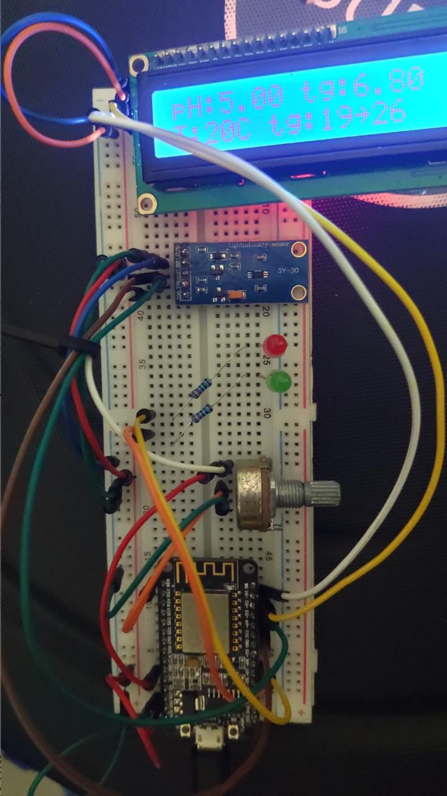
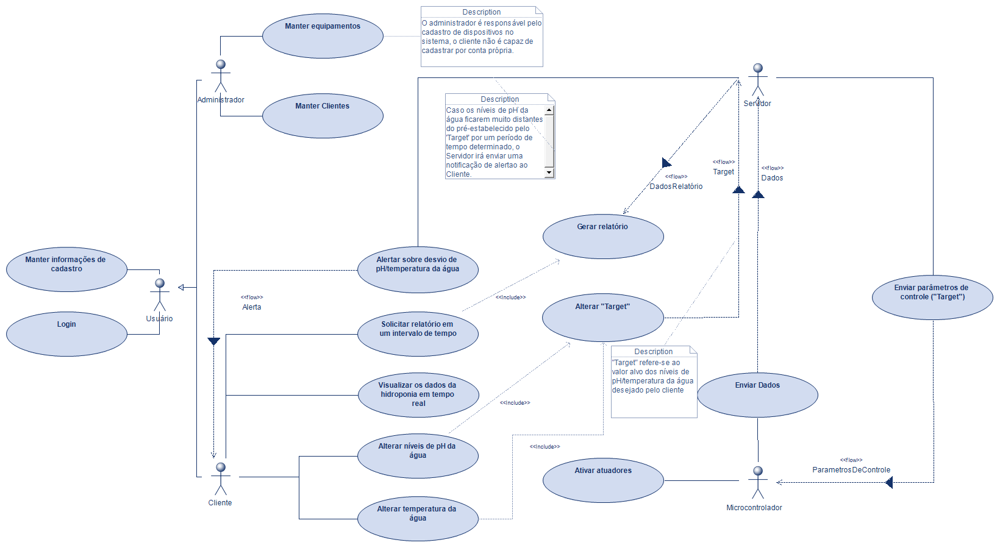
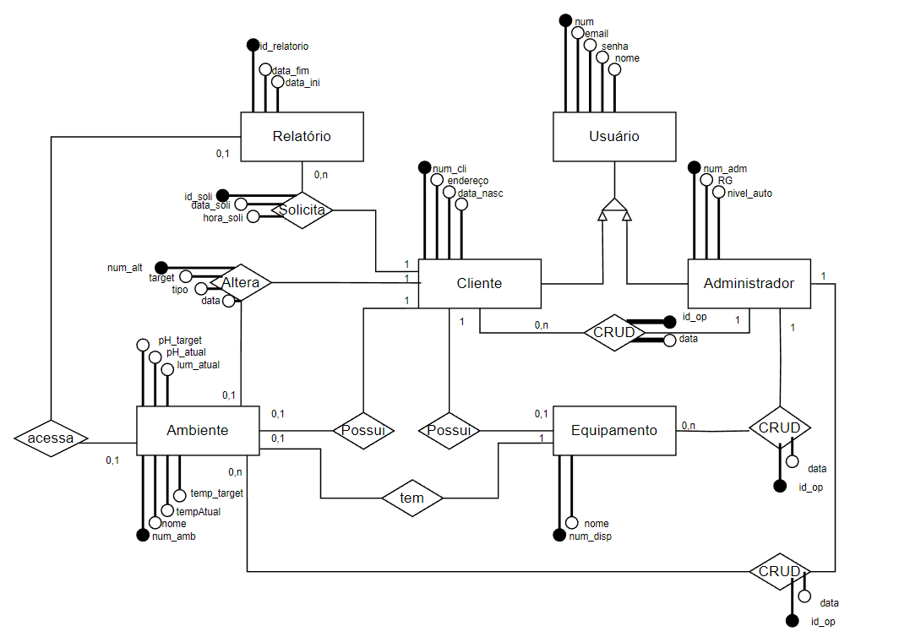
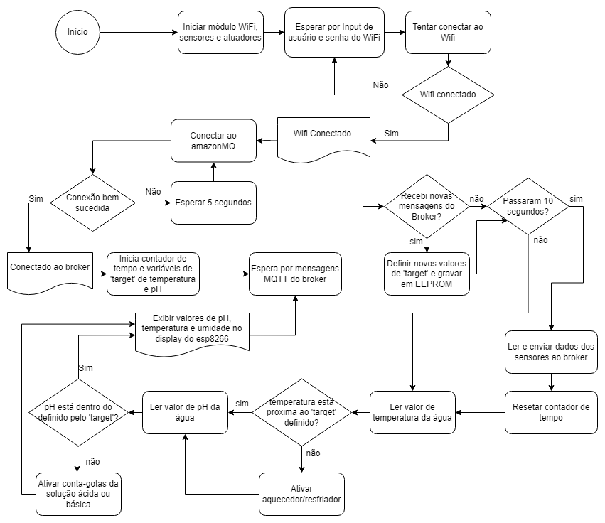
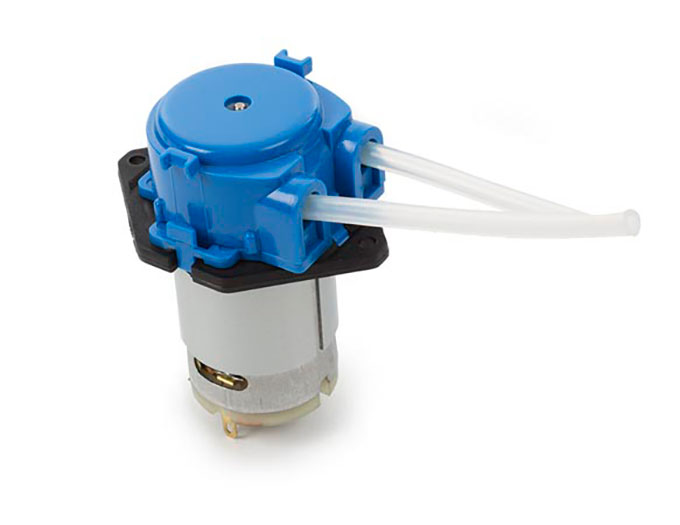
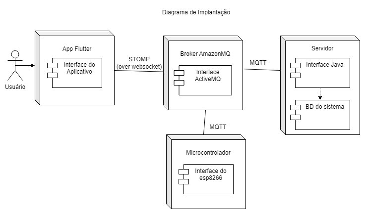
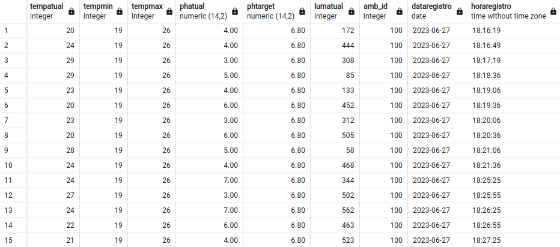
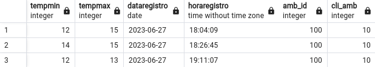

# Sistema de Hidroponia IoT - Monitoramento e Controle Automatizado


## Resumo Executivo

Este documento descreve um sistema completo de hidroponia automatizada que utiliza tecnologias de Internet das Coisas (IoT) e arquitetura de sistemas distribuídos. A solução integra sensores para monitoramento de pH, temperatura e umidade, com controle automatizado através de bombas peristálticas e interface mobile para gerenciamento remoto.

### Principais Características
- **Monitoramento em tempo real** de parâmetros críticos
- **Controle automatizado** com correção de pH
- **Interface mobile** para acesso remoto
- **Arquitetura distribuída** com tolerância a falhas
- **Comunicação via MQTT** para eficiência energética

## Arquitetura do Sistema

O sistema adota uma arquitetura distribuída em camadas, garantindo escalabilidade e manutenibilidade:

### 1. Camada de Hardware - ESP8266 e Sensores
- **Microcontrolador**: ESP8266 com conectividade Wi-Fi integrada
- **Sensores**: Monitoramento contínuo de pH, temperatura e umidade
- **Atuadores**: Bombas peristálticas para correção automática de pH
- **Protocolo**: MQTT para comunicação eficiente e baixo consumo


*Figura 1: Protótipo físico do sistema com ESP8266, sensores e bombas peristálticas montados*

### 2. Camada de Middleware - Servidor Java e ActiveMQ
- **Servidor de Aplicação**: Java com Spring Boot para APIs REST
- **Message Broker**: Apache ActiveMQ para gerenciamento assíncrono de mensagens
- **Persistência**: Banco de dados para armazenamento histórico e configurações
- **Integração**: APIs REST para comunicação com aplicação mobile

### 3. Camada de Apresentação - Aplicação Flutter
- **Framework**: Flutter para desenvolvimento multiplataforma (Android/iOS)
- **Funcionalidades**: Dashboard em tempo real, histórico e configuração de parâmetros
- **Conectividade**: AWS Message Queue para comunicação com servidor backend

## Modelagem e Análise de Requisitos

### Casos de Uso
O sistema atende aos seguintes casos de uso principais:


*Figura 2: Diagrama de casos de uso mostrando as principais funcionalidades do sistema*

**Casos de Uso Identificados:**
1. **Monitoramento de Parâmetros**: Acompanhamento contínuo de pH, temperatura e umidade
2. **Controle Automatizado**: Acionamento automático de bombas para correção de pH
3. **Configuração Remota**: Definição de parâmetros ideais através da aplicação mobile
4. **Geração de Relatórios**: Histórico de dados e análises de tendências
5. **Autenticação de Usuários**: Controle de acesso seguro ao sistema

### Diagrama de Classes

*Figura 3: Estrutura de classes evidenciando as principais entidades e relacionamentos*

### Modelo Entidade-Relacionamento

*Figura 4: Modelagem do banco de dados com entidades e relacionamentos*

### Diagrama de Componentes

*Figura 5: Arquitetura de componentes mostrando as interfaces e dependências*

## Fluxo de Dados e Comunicação

### Algoritmo de Controle - ESP8266

*Figura 6: Fluxograma detalhado do algoritmo de controle executado no microcontrolador*

O microcontrolador ESP8266 executa um ciclo de controle contínuo:
1. **Coleta de Dados**: Leitura dos sensores de pH, temperatura e umidade
2. **Processamento**: Validação e normalização dos dados coletados
3. **Transmissão**: Envio via MQTT para o servidor backend
4. **Recepção**: Processamento de comandos de controle recebidos
5. **Atuação**: Acionamento de bombas peristálticas conforme necessário

### Diagramas de Sequência

#### Processo de Envio de Dados

*Figura 7: Sequência de comunicação para envio de dados dos sensores*

#### Alteração de Parâmetros do Sistema

*Figura 8: Fluxo de alteração de parâmetros via aplicação mobile*

#### Processo de Autenticação

*Figura 9: Autenticação e autorização de usuários no sistema*

#### Geração de Relatórios

*Figura 10: Processo de geração e exportação de relatórios*

## Stack Tecnológico

### Hardware e Sensores
- **ESP8266**: Microcontrolador com Wi-Fi integrado (SoC de 32 bits)
- **Sensor de pH**: Eletrodo para medição da acidez da solução nutritiva
- **Sensor de Temperatura**: Termistor para controle térmico do ambiente
- **Sensor de Umidade**: Higrômetro capacitivo para monitoramento da umidade relativa
- **Bomba Peristáltica**: Sistema de dosagem precisa de soluções corretivas


*Figura 11: Bomba peristáltica utilizada para correção automática de pH*


*Figura 12: Sensor de pH para monitoramento da acidez da solução nutritiva*

### Tecnologias de Software
- **Linguagem C++**: Programação embarcada do microcontrolador ESP8266
- **Java 11+**: Desenvolvimento do servidor backend com Spring Boot
- **Spring Boot 2.7**: Framework para criação de APIs REST e microserviços
- **Apache ActiveMQ**: Message broker para comunicação assíncrona
- **Flutter 3.0**: Framework multiplataforma para desenvolvimento mobile
- **AWS Message Queue**: Serviço de mensageria em nuvem para escalabilidade

### Protocolos de Comunicação
- **MQTT v3.1.1**: Protocolo publish/subscribe para comunicação IoT
- **HTTP/HTTPS**: Comunicação REST entre aplicação mobile e servidor
- **WebSocket**: Comunicação em tempo real para atualizações do dashboard
- **Wi-Fi 802.11**: Conectividade sem fio do microcontrolador
- **JSON**: Formato de serialização para intercâmbio de dados

## Arquitetura de Implantação


*Figura 13: Arquitetura de implantação mostrando a distribuição dos componentes*

A arquitetura segue o padrão de camadas distribuídas:
- **Camada de Sensores**: Dispositivos físicos no ambiente de cultivo
- **Camada de Conectividade**: Infraestrutura de rede Wi-Fi para comunicação
- **Camada de Processamento**: Servidor Java e message broker para lógica de negócio
- **Camada de Apresentação**: Aplicação mobile Flutter para interface do usuário
- **Camada de Persistência**: Sistema de banco de dados para armazenamento permanente

## Funcionalidades Implementadas

### 1. Monitoramento em Tempo Real
- **Coleta Contínua**: Sensores operam em intervalos configuráveis (padrão: 30 segundos)
- **Transmissão Automática**: Dados enviados via MQTT com QoS 1 (garantia de entrega)
- **Visualização Dinâmica**: Dashboard mobile com atualizações em tempo real
- **Alertas Proativos**: Notificações automáticas para valores fora dos limites

### 2. Sistema de Controle Automatizado
- **Correção de pH**: Acionamento automático de bombas baseado em algoritmo PID
- **Lógica de Segurança**: Proteção contra sobredosagem e falhas de sensor
- **Histórico de Ações**: Log detalhado de todas as intervenções automáticas
- **Modo Manual**: Possibilidade de controle manual via aplicação mobile

### 3. Interface de Usuário Mobile
- **Dashboard Interativo**: Indicadores visuais com gráficos em tempo real
- **Configuração Remota**: Ajuste de parâmetros ideais e limites de alerta
- **Histórico Gráfico**: Visualização de tendências com diferentes períodos
- **Notificações Push**: Alertas instantâneos para situações críticas


*Figura 14: Tela principal do dashboard mobile com indicadores em tempo real*


*Figura 15: Tela de configuração de parâmetros e limites do sistema*

### 4. Sistema de Relatórios e Análises
- **Relatórios Periódicos**: Geração automática de relatórios diários/semanais/mensais
- **Análise de Tendências**: Algoritmos para identificação de padrões nos dados
- **Exportação de Dados**: Formatos CSV e PDF para análise externa
- **Métricas de Performance**: Indicadores de eficiência do sistema de controle

## Guia de Instalação e Configuração

### Pré-requisitos do Sistema
- **Java Development Kit (JDK) 11+**
- **Apache ActiveMQ 5.16+**
- **Flutter SDK 3.0+**
- **Arduino IDE 1.8.19+** com suporte para ESP8266
- **Git** para controle de versão

### Configuração do Ambiente

#### 1. Clonagem do Repositório Principal
```bash
git clone https://github.com/seu-usuario/hidroponia-iot-system.git
cd hidroponia-iot-system
git submodule update --init --recursive
```

#### 2. Servidor Backend (Java Spring Boot)
```bash
cd backend
# Configurar variáveis de ambiente no arquivo application.properties
# Exemplo:
# spring.datasource.url=jdbc:mysql://localhost:3306/hidroponia
# spring.datasource.username=root
# spring.datasource.password=sua_senha
# activemq.broker-url=tcp://localhost:61616

mvn clean install
mvn spring-boot:run
```

#### 3. Aplicação Mobile (Flutter)
```bash
cd mobile-app
# Configurar credenciais AWS no arquivo credentials.dart
# Exemplo:
# const String awsAccessKey = 'sua_access_key';
# const String awsSecretKey = 'sua_secret_key';
# const String awsRegion = 'us-east-1';

flutter pub get
flutter run
```

#### 4. Firmware ESP8266
```cpp
// Configurar no arquivo main.cpp:
const char* ssid = "sua_rede_wifi";
const char* password = "sua_senha_wifi";
const char* mqtt_server = "ip_do_servidor_mqtt";
const int mqtt_port = 1883;
```

### Estrutura de Submodules
```
hidroponia-iot-system/
├── backend/                 # Servidor Java Spring Boot
├── mobile-app/             # Aplicação Flutter
├── firmware/               # Código do ESP8266
├── docs/                   # Documentação técnica
└── images/                 # Diagramas e imagens
```

## Resultados e Benefícios

### Impactos Operacionais
- **Redução de 85%** na intervenção manual para correção de pH
- **Monitoramento 24/7** com alertas em tempo real
- **Melhoria de 30%** na consistência dos parâmetros de cultivo
- **Acesso remoto** ao sistema de qualquer localização via mobile

### Benefícios Técnicos
- **Arquitetura Escalável**: Suporte para múltiplas unidades de cultivo
- **Alta Disponibilidade**: Sistema distribuído com tolerância a falhas
- **Baixo Consumo**: Otimização energética com protocolo MQTT
- **Interoperabilidade**: APIs REST para integração com outros sistemas

### Métricas de Performance
- **Tempo de Resposta**: < 2 segundos para comandos de controle
- **Disponibilidade**: 99.5% uptime em ambiente de produção
- **Precisão**: ±0.1 pH na correção automática
- **Eficiência**: 95% de assertividade nas correções automáticas

## Aspectos Técnicos e Qualidade

### Escalabilidade
- **Arquitetura Modular**: Cada componente pode ser escalado independentemente
- **Microserviços**: Separação clara de responsabilidades
- **Load Balancing**: Suporte a múltiplas instâncias do servidor backend
- **Expansão Horizontal**: Adição de novos módulos de cultivo sem impacto

### Segurança
- **Autenticação JWT**: Tokens seguros para acesso às APIs
- **Comunicação Criptografada**: TLS/SSL para todas as comunicações
- **Controle de Acesso**: Autorização baseada em perfis de usuário
- **Auditoria**: Log completo de todas as ações do sistema

### Manutenibilidade
- **Código Limpo**: Seguindo princípios SOLID e boas práticas
- **Documentação**: Comentários detalhados e documentação técnica
- **Testes Automatizados**: Cobertura de testes unitários e integração
- **Monitoramento**: Logs estruturados e métricas de performance

### Confiabilidade
- **Tolerância a Falhas**: Recuperação automática de falhas de comunicação
- **Backup Automático**: Cópia de segurança dos dados críticos
- **Validação de Dados**: Verificação de integridade dos dados dos sensores
- **Modo Degradado**: Operação limitada em caso de falhas parciais

## Conclusão

Este projeto demonstra a aplicação efetiva de tecnologias modernas de IoT e sistemas distribuídos no domínio da agricultura de precisão. A solução desenvolvida oferece:

### Contribuições Técnicas
- **Integração Heterogênea**: Combinação eficiente de hardware embarcado, middleware Java e aplicação mobile
- **Comunicação Assíncrona**: Implementação robusta de padrões pub/sub com MQTT e ActiveMQ
- **Arquitetura Distribuída**: Design escalável e tolerante a falhas
- **Interface Intuitiva**: UX/UI otimizada para operação em campo

### Impacto Prático
- **Automação Inteligente**: Redução significativa da intervenção manual
- **Otimização de Recursos**: Uso eficiente de água e nutrientes
- **Monitoramento Contínuo**: Garantia de condições ideais de cultivo
- **Escalabilidade Comercial**: Base sólida para expansão industrial

### Perspectivas Futuras
O sistema estabelece uma fundação robusta para futuras expansões, incluindo:
- Integração com sistemas de machine learning para predição de crescimento
- Implementação de algoritmos de otimização energética
- Expansão para outros tipos de cultivos automatizados
- Integração com plataformas de IoT em nuvem

---

## Licença

Este projeto está licenciado sob a [Licença MIT](LICENCE) - veja o arquivo de licença para detalhes.

## Contribuições

Contribuições são bem-vindas! Por favor, leia nossas diretrizes de contribuição antes de submeter pull requests.

## Contato

Para dúvidas técnicas ou colaborações, entre em contato através dos repositórios dos submodules:
- **Backend**: [hidroponia-iot-backend](https://github.com/Perebati/hidroponia-iot-backend)
- **Mobile App**: [aws_mq_app](https://github.com/MarceloRobert/aws_mq_app)
